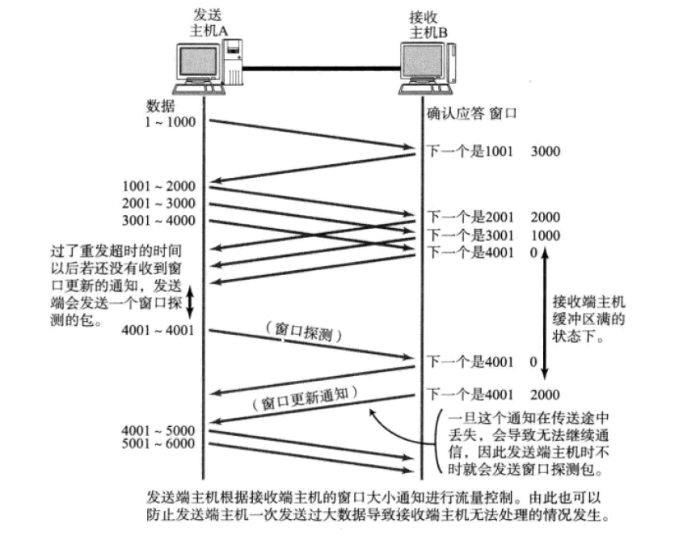

<!-- TOC -->

- [传输层](#传输层)
    - [一、端口号](#一端口号)
    - [二、TCP](#二tcp)
        - [1、通过序列号、确认应答和校验和保证传输的可靠性](#1通过序列号确认应答和校验和保证传输的可靠性)
            - [1.1 确认应答](#11-确认应答)
            - [1.2 序列号](#12-序列号)
            - [1.3 校验和](#13-校验和)
        - [2、TCP连接管理](#2tcp连接管理)
            - [2.1 三次握手](#21-三次握手)
            - [2.2 三次握手的原因](#22-三次握手的原因)
            - [2.3 四次挥手](#23-四次挥手)
            - [2.4 四次挥手的原因](#24-四次挥手的原因)
            - [2.5 TIME_WAIT](#25-time_wait)
        - [3、窗口控制](#3窗口控制)
            - [3.1 窗口](#31-窗口)
            - [3.2 窗口控制](#32-窗口控制)
        - [4、TCP流控制](#4tcp流控制)
        - [4、高速重发机制](#4高速重发机制)
        - [5、TCP拥塞控制](#5tcp拥塞控制)
        - [6、TCP首部](#6tcp首部)

<!-- /TOC -->
# 传输层

传输层的主要作用是负责建立和断开连接，实现通信两端逻辑上的连接，如果出现丢失和发送失败，传输层负责进行重发。在TCP\IP四层架构中，传输层主要负责实现应用程序之间通信连接，并通过端口号识别不同的应用程序。
传输层主要协议有：TCP和UDP两种。

## 一、端口号
---
1、端口号是用来识别计算机中进行通信的不同应用程序，传输层利用端口号将数据准确地传输给不同的应用程序。

2、端口号所对应的应用程序在UNIX环境中，被叫做守护进程。在UNIX中会启动超级守护进程inted(互联网守护进程)，会将客户端的请求复刻成为新的进程并转换为相应的守护进程。

3、建立TCP连接后，可以通过端口号确认请求是发给那个服务端应用程序的。

## 二、TCP
---
TCP是面向有连接的传输层协议，可以提供高可靠性的传输通信。

### 1、通过序列号、确认应答和校验和保证传输的可靠性

#### 1.1 确认应答
在TCP连接中，当发送端发送的数据到达接收端时，接收端会告知发送端已接受到消息的通知，这个通知就是确认应答。

如果收到肯定的确认应答，就表明数据确实发送成功了，反之，在等待一段时间后，还是没有收到确认应答，就有可能出现数据丢失的情况，这时就会进行重发。

#### 1.2 序列号
由于使用分组发送的方式发送数据，为了实现确认应答和重发控制，会使用序列号来标识每一次发送的数据，接收端查询TCP首部的序列号和数据长度，将下一次要发送的数据包序列号作为确认应答发送给发送端，这样就实现可靠传输。

#### 1.3 校验和
**校验和的目的**：进行路由器内存故障或者程序漏洞导致的数据是否破坏的检查。

**校验和算法**：TCP和UDP计算校验和时是使用伪首部。伪首部的信息来自接收端获取的数据包中的IP首部。首先将TCP首部中的校验和字段设置为0，然后以16位为一单位进行1的补码和计算，在将他们总和的1的补码和放进校验和字段中。 

### 2、TCP连接管理
---
#### 2.1 三次握手

假设 A 为客户端，B 为服务器端。

首先 B 处于 LISTEN（监听）状态，等待客户的连接请求。

A 向 B 发送连接请求报文，SYN=1，ACK=0，选择一个初始的序号 x。

B 收到连接请求报文，如果同意建立连接，则向 A 发送连接确认报文，SYN=1，ACK=1，确认号为 x+1，同时也选择一个初始的序号 y。

A 收到 B 的连接确认报文后，还要向 B 发出确认，确认号为 y+1，序号为 x+1。

B 收到 A 的确认后，连接建立。

#### 2.2 三次握手的原因

第三次握手是为了防止失效的连接请求到达服务器，让服务器错误打开连接。

客户端发送的连接请求如果在网络中滞留，那么就会隔很长一段时间才能收到服务器端发回的连接确认。客户端等待一个超时重传时间之后，就会重新请求连接。但是这个滞留的连接请求最后还是会到达服务器，如果不进行三次握手，那么服务器就会打开两个连接。如果有第三次握手，客户端会忽略服务器之后发送的对滞留连接请求的连接确认，不进行第三次握手，因此就不会再次打开连接。

#### 2.3 四次挥手

A 发送连接释放报文，FIN=1。

B 收到之后发出确认，此时 TCP 属于半关闭状态，B 能向 A 发送数据但是 A 不能向 B 发送数据。

当 B 不再需要连接时，发送连接释放报文，FIN=1。

A 收到后发出确认，进入 TIME-WAIT 状态，等待 2 MSL（最大报文存活时间）后释放连接。

B 收到 A 的确认后释放连接。

#### 2.4 四次挥手的原因

客户端发送了 FIN 连接释放报文之后，服务器收到了这个报文，就进入了 CLOSE-WAIT 状态。这个状态是为了让服务器端发送还未传送完毕的数据，传送完毕之后，服务器会发送 FIN 连接释放报文。

#### 2.5 TIME_WAIT

客户端接收到服务器端的 FIN 报文后进入此状态，此时并不是直接进入 CLOSED 状态，还需要等待一个时间计时器设置的时间 2MSL。这么做有两个理由：

1、确保最后一个确认报文能够到达。如果 B 没收到 A 发送来的确认报文，那么就会重新发送连接释放请求报文，A 等待一段时间就是为了处理这种情况的发生。

2、等待一段时间是为了让本连接持续时间内所产生的所有报文都从网络中消失，使得下一个新的连接不会出现旧的连接请求报文。

### 3、窗口控制
TCP是以1段来进行数据发送的，没法一段来进行一个应答。但是这种方式会因为网络问题导致的包往返时间增加而降低效率。所以就提出了窗口的概念。

#### 3.1 窗口
窗口是由多个段组成，窗口大小是由接收端决定的，在建立连接时会将窗口大小通知发送端。窗口大小的值连续发送不需要应答的而可以连续发送的数据的最大值。

#### 3.2 窗口控制
引入窗口后，确认应答就不用以一段为单位进行了，而是连续发送后再进行应答，在数据发出后，为了实现这种机制，在发送方和接收端都维护了缓冲区，发送端的缓冲区存放代发送的数据，如果出现丢包，可以进行重发；接收端的缓冲区放置接收到的数据，当存放的数据超过缓存的大小时，会停止接收数据，直到缓存中内容被释放。

如果如期收到应答，则说明应答号之前的内容就不用重发了，数据就可以从缓存中清除了。这时窗口会滑向下一个分段，这样可以顺序的将多个段同时发送消息提高通信。

### 4、TCP流控制
---
当接收端无法及时处理发送端发送过来的大量数据时，会将这些数据放入接收端的缓存区中；
当缓存区存满后，发送端继续发送数据的话，接收端只好将发送的数据丢弃，这样就可能触发重发机制，导致网络资源的浪费。

为了避免上述情况的出现，TCP提供了流控制机制。

TCP在首部字段中提供窗口大小字段，接收端可以使用这个字段在进行应答时将自身缓存剩余大小发送给发送端，发送端接收后，就可以调整发送数据的大小。

如果接收端缓存区大小为0时则停止接收数据，等到处理完当前缓存中的数据后，会向发送端发送缓存更新通知，通知可以继续发送数据。

如果更新通知在发送过程中出现丢包，则无法通知发送端。为应对这种情况，发送端会时不时发送窗口探测包，包内只有一个字节，用来表示当前窗口大小，来判断是否可以继续发送数据。

### 4、高速重发机制
---

主要有两种情况：
1、接收端发送的应答丢失：出现这种情况时，会直接发送下一段来进行弥补。

2、发送端报文丢失：这时接收端会连续发送确认应答，接收端接收到相同的连续应答，会对丢失的这段报文进行重发。

### 5、TCP拥塞控制
---
如果网络出现拥塞，分组将会丢失，此时发送方会继续重传，从而导致网络拥塞程度更高。因此当出现拥塞时，应当控制发送方的速率。这一点和流量控制很像，但是出发点不同。流量控制是为了让接收方能来得及接收，而拥塞控制是为了降低整个网络的拥塞程度。

为了在发送端调节所有发送的数据量大小，会设置一个“拥塞窗口”的概念。在发送数据包时，会与接收端主机通知的窗口大小作比较，取较小的值作为发送数据量的大小。

TCP拥塞控制主要有两种手段：慢开始、拥塞避免。

在TCP开始时执行慢开始，将窗口大小设置为一个较小的值，随着时间的增加，窗口大小逐渐增加，这时设置一个阀值，当窗口大小超过阀值时，执行拥塞避免，每次窗口增加的值减小。

如果出现超时现象则窗口大小设置为阀值的一半，并重新执行慢开始。

### 6、TCP首部
---

- **序号**：是指发送数据的位置。没次送一次数据，就累加一次该数据字节的大小。序号的初始值不是从0或者1开始的，而是在创建连接时由计算机生成的随机数作为初始值，通过SYN包发送给接收端，然后每次发送数据就累加数据字节大小，作为数据的位置。  

- **确认号**：是指已收到确认应答号的前一位为止的数据，如果发送端收到这个确认应答就表示这个应答号之前的数据都已经确认接收了，无需重发。

- **数据偏移**：表示TCP报文段中从哪一位开始时数据部分，也可以表示TCP的长度，单位为4字节。

- **控制位-SYN**： 用于建立连接。SYN等于1时表示希望建立连接，并在其序列号的字段进行序列号初始化的设定。

- **控制位-ACK** ：当 ACK=1 时确认号字段有效，否则无效。TCP 规定，在连接建立后所有传送的报文段都必须把 ACK 置 1。

- **控制位-FIN**：当该位为1时，表示希望断开连接。当通信结束希望断开连接时，通信双方互相发送FIN包，主机方确认后就可以断开连接了。不过主机收到FIN等于1的包后，可以等到缓存中所有数据发送完毕后，在发送确认包。

- **窗口大小**：用于通知通信双方不用应答能够连续发送的数据包的大小，如果数值为0，发送端就要发送窗口探测，来获取窗口大小。
