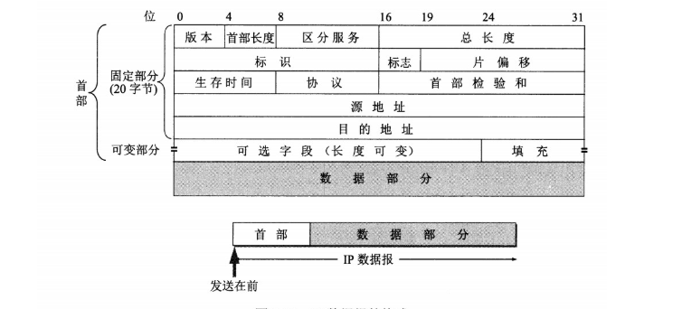
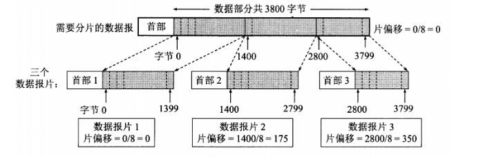

<!-- TOC -->

- [网络层](#网络层)
    - [一、 IP](#一-ip)
    - [二、IP首部](#二ip首部)
    - [三、 路由控制](#三-路由控制)
            - [1、路由控制表形成方式](#1路由控制表形成方式)
            - [2、路由控制表](#2路由控制表)
            - [3、路由算法](#3路由算法)
            - [4、路由协议](#4路由协议)
- [IP相关技术](#ip相关技术)
    - [一、DNS](#一dns)
            - [1、概要](#1概要)
            - [2、DNS机制](#2dns机制)
            - [3、DNS查询](#3dns查询)
    - [二、ARP](#二arp)
            - [1、概要](#1概要-1)
            - [2、工作机制](#2工作机制)
    - [三、ICMP](#三icmp)
            - [1、概要](#1概要-2)
            - [2、主要的ICMP消息](#2主要的icmp消息)
    - [四、DHCP](#四dhcp)

<!-- /TOC -->

# 网络层

网络层的主要作用是实现点对点之间的通信，可以跨越不同链路完成两端节点的通信。

---

## 一、 IP

IP主要由三大作用模块：1、IP地址 2、路由（最终节点为止的转发） 3、IP分包和组包

IP地址相当于网络环境中每个主机的唯一标识，在TCP/IP中每个主机都必须设定自己的IP地址。

IP地址是面向无连接的，目的是进行简化和提速。IP是尽力型协议，只是尽最大的努力将数据发送到目标地址，不会进行确认是否收到。

1、**定义**：IPv4地址是由32位2进制数组成，现在是使用每8位一组，分成4组，中间以“.”分割，为了方便记忆转换成10进制。

2、**组成**：IP地址是由“网络地址”和“主机地址”组成。如果网络地址相同，主机地址不同，说明是属于同一网段。

3、**编址方式**： IP地址的编址方式经历了三个历史阶段：
- 分类
- 子网划分
- 无分类

1).**分类**

由两部分组成，网络号和主机号，其中不同分类具有不同的网络号长度，并且是固定的。

IP 地址 ::= {< 网络号 >, < 主机号 >}

2).**子网划分**
通过在主机号字段中拿一部分作为子网号，把两级 IP 地址划分为三级 IP 地址。

IP 地址 ::= {< 网络号 >, < 子网号 >, < 主机号 >}

要使用子网，必须配置子网掩码。一个 B 类地址的默认子网掩码为 255.255.0.0，如果 B 类地址的子网占两个比特，那么子网掩码为 11111111 11111111 11000000 00000000，也就是 255.255.192.0。

注意，外部网络看不到子网的存在。

3).**无分类**
无分类编址 CIDR 消除了传统 A 类、B 类和 C 类地址以及划分子网的概念，使用网络前缀和主机号来对 IP 地址进行编码，网络前缀的长度可以根据需要变化。

IP 地址 ::= {< 网络前缀号 >, < 主机号 >}

CIDR 的记法上采用在 IP 地址后面加上网络前缀长度的方法，例如 128.14.35.7/20 表示前 20 位为网络前缀。

CIDR 的地址掩码可以继续称为子网掩码，子网掩码首 1 长度为网络前缀的长度。

一个 CIDR 地址块中有很多地址，一个 CIDR 表示的网络就可以表示原来的很多个网络，并且在路由表中只需要一个路由就可以代替原来的多个路由，减少了路由表项的数量。把这种通过使用网络前缀来减少路由表项的方式称为路由聚合，也称为 **构成超网** 。

在路由表中的项目由“网络前缀”和“下一跳地址”组成，在查找时可能会得到不止一个匹配结果，应当采用最长前缀匹配来确定应该匹配哪一个。

## 二、IP首部

* **版本**：表示IP首部的版本号，有4和6两个值。

* **首部长度**：表明IP首部大小，单位为4字节（32比特）。对于没有可选项的IP包，首部长度可以设置为“5”。

* **总长度**：表示IP首部与数据部分合起来的总字节数。该字段长16字节，因此IP包的最大长度是2^16。

* **标识**：由16比特构成，用于重组分片。同一分片的标识值相同，不同分片的标识值不同。如果目标地址、原地址或者协议不同，即使标识值相同，也不会认为是同一分片。

* **片偏移**：由13比特组成，用来表示被分片的分组相对于原始数据的位置。

* **生存时间（TTL）**：表示数据包可以中转多少个路由器的意思。每经过一个路由器这个值就减一，直到减少到0，这个数据包就被丢弃。

* **首部校验和**：用来确保IP数据不被破坏。首先将首部中的校验和字段设置为0，然后以16位为一单位进行1的补码和计算，在将他们总和的1的补码和放进校验和字段中。 

## 三、 路由控制
---
在网络通信中如果只有IP地址就像出去旅游只知道起点和终点，而不知怎么才能从起点到达终点，这时就需要类似“路线图”一样的东西了，在网络通信中路线图就是路由控制表。通信就是基于控制表来发送数据的。

####1、路由控制表形成方式
- 静态路由：由管理员手动设置也叫**静态路由**。静态路由是事先在路由器上设置好路由器与主机的联系的一种方式。

- 动态路由：通过路由协议运行自动生成路由控制表的方式叫做**动态路由**。这个过程中，路由器之间会互相发送自己已经的网络信息，以接力的方式进行传递，直到整个网络都了解，路由控制表也就完成了。

####2、路由控制表
路由控制表中记录着网络地址与下一“跳”应该发送到的路由器的地址。

在发送IP包时，应该先确认IP首部中的目标IP地址中的网络地址，在从路由控制表中查找到相同的网络地址，在将数据包转发到下一个路由器。如果控制表中存在多条相同的路径，则选择一条最符合的路径。

- **默认路由**：是指路由表中任何一个地址都能匹配上的记录。一般标记为0.0.0.0或者default

- **主机路由**：“IP地址/32”这种表示方式属于主机路由。它的意思是指用整个IP地址进行路由，如不是只有网络部分进行路由。

- **回环地址**：是在同一个计算机上的程序之间进行网络通信时所使使用的一个默认地址。计算机中使用127.0.0.1作为回环地址，与之匹配的主机名称为localhost。使用这个主机名或IP地址，数据不会发送到网络。

####3、路由算法
主要有两种算法：**距离向量算法、链路状态算法**。

**距离向量算法**
根据距离（代价）和方向决定目标网络或者目标主机位置的一种算法。路由器之间可以互换目标网络的方向和距离的相关信息，以这些信息为基础生成路由控制表。

 **链路状态算法**
根据路由器了解整个网络链接状态的基础上生成的路由控制表的一种方法。在这种标准中，每台路由器获取的网络链接状态必须保持一致。

####4、路由协议
现在使用的路由协议主要有两种类型：IGP、BGP。
- IGP：自治系统内部使用的路由控制采用的就是域内路由协议。

- BGP：在自治系统之间使用的路由协议就是域间路由协议。

自治系统指的是可以自己制定路由策略并能在一个小范围中实行这个策略的小型单位。例如：区域网络、某公司或组织。

**内部网关协议 RIP**

RIP 是一种基于距离向量的路由选择协议。距离是指跳数，直接相连的路由器跳数为 1。跳数最多为 15，超过 15 表示不可达。

RIP 按固定的时间间隔(30秒一次)仅和相邻路由器交换自己的路由表，经过若干次交换之后，所有路由器最终会知道到达本自治系统中任何一个网络的最短距离和下一跳路由器地址。

RIP 协议实现简单，开销小。但是 RIP 能使用的最大距离为 15，限制了网络的规模。并且当网络出现故障时，要经过比较长的时间才能将此消息传送到所有路由器。

**内部网关协议 OSPF**

开放最短路径优先 OSPF，是为了克服 RIP 的缺点而开发出来的。

开放表示 OSPF 不受某一家厂商控制，而是公开发表的；最短路径优先表示使用了 Dijkstra 提出的最短路径算法 SPF。

OSPF 具有以下特点：

向本自治系统中的所有路由器发送信息，这种方法是洪泛法。
发送的信息就是与相邻路由器的链路状态，链路状态包括与哪些路由器相连以及链路的度量，度量用费用、距离、时延、带宽等来表示。
只有当链路状态发生变化时，路由器才会发送信息。
所有路由器都具有全网的拓扑结构图，并且是一致的。相比于 RIP，OSPF 的更新过程收敛的很快。

**外部网关协议 BGP**

BGP（Border Gateway Protocol，边界网关协议）

AS 之间的路由选择很困难，主要是由于：

互联网规模很大；
各个 AS 内部使用不同的路由选择协议，无法准确定义路径的度量；
AS 之间的路由选择必须考虑有关的策略，比如有些 AS 不愿意让其它 AS 经过。
BGP 只能寻找一条比较好的路由，而不是最佳路由。

每个 AS 都必须配置 BGP 发言人，通过在两个相邻 BGP 发言人之间建立 TCP 连接来交换路由信息。

# IP相关技术
---
## 一、DNS
#### 1、概要
由于有主机识别码的存在，这种识别方式是为每台计算机指定一个唯一的主机名，在进行网络通信时，可以不用输入IP地址而是直接使用主机名进行通信。同时，系统也要将主机名和IP地址进行转换，所以系统要维护一个IP地址和主机名对应关系的hosts数据库。这些信息一开始是由互联网信息中心统一管理的，经过一段时间后，网络信息逐渐变大，这些对应关系信息变得难以维护，所以产生了可以有效维护这些信息的系统DNS。

#### 2、DNS机制
当用户输入主机名时，DNS会自动检测那个注册了主机名和IP地址的数据库，并迅速定位到IP地址。

#### 3、DNS查询
解析器为了调查IP地址，向域名服务器请求查询处理。当域名服务器接收到查询请求，会在自己的数据库查找，如果找到了就将IP地址返回，如果没有找到，就向上一层域名服务器继续请求，直到找到为止，最后由找到的那台服务器返回IP地址信息。

解析器和域名服务器会将最新的信息储存在自己的缓存里，这样可以减少查询的消耗。
## 二、ARP
####1、概要
ARP是解决地址问题的协议，在已知目标IP地址的情况下，用来定位下一个应该接受数据分包的网络设备对应的MAC地址。如果目标地址不在同一链路，则会获得下一跳路由器的MAC地址。

#### 2、工作机制
ARP主要通过**ARP请求包**和**ARP响应包**确定MAC地址。

起初，发送端主机会通过广播发送ARP请求包，链路中所有的路由器都会收到请求。如果出现与包中目标IP地址相同的路由器，会发送响应包给发送端主机，包中会包含自身的MAC地址。

## 三、ICMP
####1、概要
ICMP的主要功能是：确认IP数据包是否成功发送到对端，IP数据包在发送的过程中丢包的原因，改善网络配置。

ICMP的消息主要有两种类型：1、通知出错的错误信息 2、用于诊断的查询信息。

#### 2、主要的ICMP消息
-**ICMP目标不可达消息**
IP路由器无法将数据包发送给目标地址时，会发送这样的消息，并在其中放置不可达的原因。

-**ICMP重定向消息**
当路由器发现有更好的发送路径时，会发送这样的ICMP消息，包含路由信息和源数据。

-**ICMP超时消息**
当IP首部中的TTL字段变为0时，表示连接超时数据被丢弃，这时会发送ICMP超时消息给发送端主机，表示数据被丢弃。

-**ICMP回送消息**
用于进行通信的主机或路由器之间，判断所发送的数据包是否成功到达对端的一种消息类型，可以向对端发送消息，也可以收到对端发送的响应消息。ping命令就是利用这个消息实现的。

## 四、DHCP

